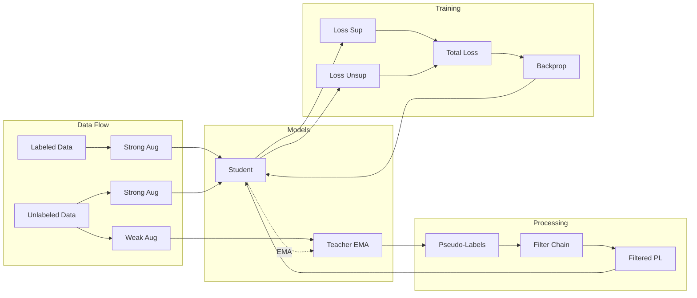

# Báo Cáo Kỹ Thuật: Giải Pháp Semi-Supervised Training cho YOLOv11

## Tổng Quan Hệ Thống

Dự án triển khai framework **Semi-Supervised Learning** (SSL) cho object detection dựa trên YOLOv11, kết hợp nhiều kỹ thuật tiên tiến: Teacher-Student paradigm với EMA, Pseudo-label filtering (DSAT, NMS-Unc), Background Penalty loss, và Consistency Regularization.

---

## 1. Kiến Trúc Tổng Quan

### 1.1 Teacher-Student Paradigm



### 1.2 Components Chính

| Component | Module | Chức năng |
|-----------|--------|-----------|
| `SemiTrainer` | `trainer/semi_trainer.py` | Training loop chính |
| `SelectiveModelEMA` | `utils/selective_ema.py` | EMA update cho teacher |
| `v8DetectionLossWithBgPenalty` | `losses/bg_penalty_loss.py` | Custom loss với BG penalty |
| `DSATFilter` | `filters/dsat.py` | Dynamic Self-Adaptive Threshold |
| `NMS-Unc` | `filters/nms_unc.py` | NMS với uncertainty estimation |
| `FilterChain` | `filters/base.py` | Pipeline lọc pseudo-labels |

---

## 2. Công Thức Toán Học Chi Tiết

### 2.1 Notation

| Ký hiệu | Định nghĩa | Kích thước |
|---------|------------|------------|
| $B$ | Batch size | Scalar |
| $N$ | Số anchor points | $\sum_{l} H_l \times W_l$ |
| $C$ | Số classes | Scalar |
| $\hat{\mathbf{y}}_{ij}$ | Predicted class logits | $\in \mathbb{R}^C$ |
| $\hat{\mathbf{b}}_{ij}$ | Predicted bounding box | $\in \mathbb{R}^4$ (xyxy) |
| $\mathbf{y}_{ij}$ | Target alignment scores | $\in [0,1]^C$ |
| $\sigma(\cdot)$ | Sigmoid function | $\sigma(x) = \frac{1}{1+e^{-x}}$ |
| $\theta_s, \theta_t$ | Student/Teacher parameters | $\in \mathbb{R}^P$ |

---

### 2.2 Total Training Loss

**Semi-Supervised Total Loss:**

$$\boxed{\mathcal{L}_{\text{total}} = \mathcal{L}_{\text{sup}} + \lambda_u(t) \cdot \mathcal{L}_{\text{unsup}}}$$

Trong đó:
- $\mathcal{L}_{\text{sup}}$: Supervised loss trên labeled data
- $\mathcal{L}_{\text{unsup}}$: Unsupervised loss trên pseudo-labels
- $\lambda_u(t)$: Unsupervised weight schedule

---

### 2.3 YOLO Detection Loss Components

#### 2.3.1 Classification Loss (BCE với TAL)

$$\mathcal{L}_{\text{cls}} = \frac{1}{\sum_{i,j} \mathbf{y}_{ij}} \sum_{i=1}^B \sum_{j=1}^N \sum_{c=1}^C \mathcal{L}_{\text{BCE}}(\hat{y}_{ij}^c, y_{ij}^c)$$

Với Binary Cross-Entropy:

$$\mathcal{L}_{\text{BCE}}(\hat{y}, y) = -\left[ y \cdot \log \sigma(\hat{y}) + (1-y) \cdot \log(1-\sigma(\hat{y})) \right]$$

**Task-Aligned Learning (TAL) Assignment:**

$$y_{ij}^c = \begin{cases}
t_{ij}^\alpha \cdot \text{IoU}(\hat{\mathbf{b}}_{ij}, \mathbf{b}_{ij}^{gt})^\beta & \text{if anchor assigned} \\
0 & \text{if background}
\end{cases}$$

Với hyperparameters: $\alpha = 0.5$, $\beta = 6.0$

#### 2.3.2 Bounding Box Loss (CIoU)

$$\mathcal{L}_{\text{box}} = \frac{1}{\sum_{i,j} \mathbf{y}_{ij}} \sum_{(i,j) \in \mathcal{F}} w_{ij} \cdot (1 - \text{CIoU}(\hat{\mathbf{b}}_{ij}, \mathbf{b}_{ij}^{gt}))$$

**Complete IoU:**

$$\text{CIoU} = \text{IoU} - \frac{\rho^2(\mathbf{c}, \mathbf{c}^{gt})}{d^2} - \alpha_{\text{CIoU}} \cdot v$$

Trong đó:
- $\rho(\mathbf{c}, \mathbf{c}^{gt})$: Euclidean distance giữa centers
- $d$: Đường chéo smallest enclosing box
- $v = \frac{4}{\pi^2}\left(\arctan\frac{w^{gt}}{h^{gt}} - \arctan\frac{w}{h}\right)^2$: Aspect ratio penalty
- $\alpha_{\text{CIoU}} = \frac{v}{(1-\text{IoU}) + v}$

#### 2.3.3 Distribution Focal Loss (DFL)

$$\mathcal{L}_{\text{dfl}} = \frac{1}{\sum_{i,j} \mathbf{y}_{ij}} \sum_{(i,j) \in \mathcal{F}} w_{ij} \cdot \text{DFL}(\hat{\mathbf{d}}_{ij}, \mathbf{t}_{ij})$$

Cho target $t \in [0, 15]$ (reg_max=16):

$$\text{DFL}(\hat{\mathbf{d}}, t) = -\left[ (t_r - t) \log p_{t_l} + (t - t_l) \log p_{t_r} \right]$$

Với:
- $t_l = \lfloor t \rfloor$, $t_r = t_l + 1$
- $p_k = \text{softmax}(\hat{\mathbf{d}})_k$

#### 2.3.4 Total Detection Loss

$$\mathcal{L}_{\text{det}} = \lambda_{\text{box}} \cdot \mathcal{L}_{\text{box}} + \lambda_{\text{cls}} \cdot \mathcal{L}_{\text{cls}}^{\text{total}} + \lambda_{\text{dfl}} \cdot \mathcal{L}_{\text{dfl}}$$

**Default hyperparameters:**
- $\lambda_{\text{box}} = 7.5$
- $\lambda_{\text{cls}} = 0.5$
- $\lambda_{\text{dfl}} = 1.5$

---

### 2.4 Background Penalty

**Mục đích:** Giảm false positives bằng cách phạt predictions cao trên vùng background.

#### 2.4.1 Background Anchor Definition

$$\mathcal{B} = \left\{ (i,j) : \sum_{c=1}^C y_{ij}^c < \epsilon \right\}$$

với $\epsilon = 10^{-6}$.

#### 2.4.2 Simple Max Penalty (Default)

$$\mathcal{L}_{\text{bg}} = \frac{\lambda_{\text{bg}}}{|\mathcal{B}|} \sum_{(i,j) \in \mathcal{B}} \max_{c=1}^C \sigma(\hat{y}_{ij}^c)$$

**Gradient Analysis:**

$$\frac{\partial \mathcal{L}_{\text{bg}}}{\partial \hat{y}_{ij}^{c^*}} = \frac{\lambda_{\text{bg}}}{|\mathcal{B}|} \cdot \sigma(\hat{y}_{ij}^{c^*}) \cdot (1 - \sigma(\hat{y}_{ij}^{c^*}))$$

với $c^* = \arg\max_c \sigma(\hat{y}_{ij}^c)$.

**Gradient magnitude:** Maximum tại $\sigma(\hat{y}) = 0.5$, bằng $\frac{\lambda_{\text{bg}}}{4|\mathcal{B}|}$.

#### 2.4.3 Focal-Style Penalty (Optional)

$$\mathcal{L}_{\text{bg}}^{\text{focal}} = \frac{\lambda_{\text{bg}}}{|\mathcal{B}|} \sum_{(i,j) \in \mathcal{B}} \sum_{c=1}^C \left[ -(1-p_{ij}^c)^\gamma \log(1-p_{ij}^c) \right]$$

với $\gamma = 2.0$.

#### 2.4.4 Modified Classification Loss

$$\boxed{\mathcal{L}_{\text{cls}}^{\text{total}} = \mathcal{L}_{\text{cls}}^{\text{BCE}} + \mathcal{L}_{\text{bg}}}$$

---

### 2.5 Exponential Moving Average (EMA) Teacher

**Update Rule:**

$$\theta_t^{(k+1)} = \alpha \cdot \theta_t^{(k)} + (1-\alpha) \cdot \theta_s^{(k)}$$

với $\alpha = 0.9999$ (decay rate).

**Selective EMA (cho frozen parameters):**

$$\theta_{t,i}^{(k+1)} = \begin{cases}
\alpha \cdot \theta_{t,i}^{(k)} + (1-\alpha) \cdot \theta_{s,i}^{(k)} & \text{if } \nabla_{\theta_{s,i}} \neq 0 \text{ (trainable)} \\
\theta_{t,i}^{(k)} & \text{if frozen}
\end{cases}$$

**Complexity:** $O(P_{\text{trainable}})$ thay vì $O(P_{\text{total}})$.

---

### 2.6 Unsupervised Loss Weight Schedule

$$\lambda_u(t) = \begin{cases}
0 & t < t_{\text{burn-in}} \\
\lambda_u^{\max} \cdot \min\left(1, \frac{t - t_{\text{burn-in}}}{t_{\text{warmup}}}\right) & t_{\text{burn-in}} \leq t < t_{\text{burn-in}} + t_{\text{warmup}} \\
\lambda_u^{\max} & t \geq t_{\text{burn-in}} + t_{\text{warmup}}
\end{cases}$$

**Default values:**
- $t_{\text{burn-in}} = 5$ epochs
- $t_{\text{warmup}} = 5$ epochs
- $\lambda_u^{\max} = 2.0$

**Schedule visualization:**

```
λ_u
 |
2.0|         ______________
   |        /
1.0|       /
   |      /
0.0|_____/
   +-----+----+------------->
   0     5    10        epochs
   ←burn→←warm→←  semi  →
```

---

### 2.7 Background Penalty Schedule

$$\lambda_{\text{bg}}(t) = \begin{cases}
0 & t < t_{\text{burn-in}} \\
\lambda_{\text{bg}}^{\max} \cdot f_{\text{schedule}}\left(\frac{t - t_{\text{burn-in}}}{t_{\text{warmup}}}\right) & \text{otherwise}
\end{cases}$$

**Schedule functions:**
- **Linear:** $f(x) = \min(1, x)$
- **Cosine:** $f(x) = \frac{1 - \cos(\pi \cdot \min(1,x))}{2}$
- **Step:** $f(x) = \mathbb{1}[x \geq 1]$

---

## 3. Pseudo-Label Filtering Pipeline

### 3.1 Filter Chain Architecture

```
Teacher Output → NMS-Unc → DSAT Filter → (Optional: DFL Entropy) → (Optional: TAL Alignment) → Filtered Labels
```

### 3.2 NMS with Uncertainty (NMS-Unc)

**Uncertainty Estimation:**

Cho detection $i$ với redundant boxes $\mathcal{R}_i$ (suppressed bởi NMS):

$$\sigma_i = \frac{1}{4}\left( \sigma_x^{norm} + \sigma_y^{norm} + \sigma_w^{norm} + \sigma_h^{norm} \right)$$

Với normalized standard deviations:

$$\sigma_x^{norm} = \frac{\text{std}(c_x)}{\text{mean}(w)}, \quad \sigma_y^{norm} = \frac{\text{std}(c_y)}{\text{mean}(h)}$$

$$\sigma_w^{norm} = \frac{\text{std}(w)}{\text{mean}(w)}, \quad \sigma_h^{norm} = \frac{\text{std}(h)}{\text{mean}(h)}$$

**Filtering:**

$$\text{keep}_i = \mathbb{1}[\sigma_i \leq \tau_{\text{unc}}]$$

**Intuition:** Low uncertainty = consistent predictions từ nhiều góc nhìn = reliable pseudo-label.

### 3.3 Dynamic Self-Adaptive Threshold (DSAT)

**Per-class adaptive thresholding dựa trên F1-score:**

#### 3.3.1 Threshold Update Rule

$$\tau_c^{(k+1)} = m \cdot \tau_c^{(k)} + (1-m) \cdot \hat{\tau}_c^{(k)}$$

Với:
- $m = 0.995$: Momentum rate
- $\hat{\tau}_c^{(k)}$: Target threshold từ F1-score

#### 3.3.2 Target Threshold từ F1

$$\hat{\tau}_c = \tau_{\min} + F_1^{(c)} \cdot (\tau_{\max} - \tau_{\min})$$

Với:
- $\tau_{\min} = 0.1$, $\tau_{\max} = 0.9$
- $F_1^{(c)}$: Per-class F1 score từ teacher validation

**Logic:**
- High F1 → model confident → higher threshold
- Low F1 → model uncertain → lower threshold → giữ nhiều pseudo-labels hơn

#### 3.3.3 Filtering Condition

$$\text{keep}_i = \mathbb{1}\left[ p_i^{c_i} \geq \tau_{c_i} \right] \land \mathbb{1}\left[ \sigma_i \leq \frac{\tau_{c_i}}{2} \right]$$

---

## 4. Training Algorithm

### 4.1 Complete Training Loop

```
Algorithm: Semi-Supervised YOLO Training

Input: 
  - D_L: Labeled dataset
  - D_U: Unlabeled dataset
  - θ_s: Student model parameters
  - T: Total epochs

Initialize:
  - θ_t ← θ_s (Teacher = copy of Student)
  - FilterChain: [DSAT, ...]

for epoch = 1 to T:
  # Phase detection
  if epoch < burn_in:
    mode ← "burn-in"
    λ_u ← 0
    λ_bg ← 0
  else:
    mode ← "semi"
    λ_u ← warmup_schedule(epoch)
    λ_bg ← bg_schedule(epoch)
  
  # Update DSAT thresholds
  if mode == "semi":
    F1_scores ← validate(θ_t, D_val)
    DSAT.update_from_f1(F1_scores)
  
  for batch in DataLoader:
    # 1. Get data
    (x_L, y_L), x_U_weak, x_U_strong ← batch
    
    # 2. Supervised forward
    ŷ_L ← Student(x_L)
    L_sup ← DetectionLoss(ŷ_L, y_L) + λ_bg * BgPenalty(ŷ_L, y_L)
    
    # 3. Unsupervised forward (if not burn-in)
    if mode == "semi":
      # Teacher generates pseudo-labels
      with no_grad:
        ỹ_U ← Teacher(x_U_weak)
      
      # Filter pseudo-labels
      ỹ_U_filtered ← FilterChain(ỹ_U)
      
      if len(ỹ_U_filtered) > 0:
        # Student learns from pseudo-labels
        ŷ_U ← Student(x_U_strong)
        L_unsup ← DetectionLoss(ŷ_U, ỹ_U_filtered)
      else:
        L_unsup ← 0  # Or consistency loss
    else:
      L_unsup ← 0
    
    # 4. Total loss & backprop
    L_total ← L_sup + λ_u * L_unsup
    L_total.backward()
    optimizer.step()
    
    # 5. Update teacher (EMA)
    θ_t ← α * θ_t + (1-α) * θ_s
  
  # 6. Validation & checkpointing
  metrics ← validate(θ_s, D_val)
  save_checkpoint(epoch, metrics)
```

### 4.2 Forward Pass Analysis

**Per-iteration Forward Passes:**

| Component | Forward Passes | Notes |
|-----------|---------------|-------|
| Student (labeled) | 1 | Always |
| Teacher (unlabeled weak) | 1 | If not burn-in |
| Student (unlabeled strong) | 1 | If pseudo-labels exist |

**Total Complexity:** $O(3 \cdot \text{Forward})$ trong semi phase.

---

## 5. Augmentation Strategy

### 5.1 Weak Augmentation (Teacher Input)

Minimal transformations để giữ nguyên semantics:

```yaml
weak:
  mosaic: 0.0       # Không mosaic
  mixup: 0.0        # Không mixup
  fliplr: 0.5       # Horizontal flip
  scale: 0.2        # Scale ±20%
```

### 5.2 Strong Augmentation (Student Input)

Aggressive transformations để tăng diversity:

```yaml
strong:
  mosaic: 1.0       # Always mosaic
  mixup: 0.5        # 50% mixup
  fliplr: 0.5       # Horizontal flip
  scale: 0.7        # Scale ±70%
  hsv_h: 0.0        # (Disabled for thermal images)
  hsv_s: 0.0
  hsv_v: 0.0
```

### 5.3 Thermal-Specific Augmentation

```python
class ThermalAugmentation:
    """Augmentation cho thermal/infrared images."""
    
    def __call__(self, x: Tensor) -> Tensor:
        # Gaussian noise simulation
        noise = torch.randn_like(x) * sigma
        return x + noise
```

---

## 6. Consistency Regularization (Fallback)

**Khi không có pseudo-labels:**

$$\mathcal{L}_{\text{consistency}} = 1 - \frac{\mathbf{z}_w \cdot \mathbf{z}_s}{\|\mathbf{z}_w\|_2 \|\mathbf{z}_s\|_2}$$

với $\mathbf{z}_w = f_\theta(\mathcal{A}_w(x))$ và $\mathbf{z}_s = f_\theta(\mathcal{A}_s(x))$.

**Theoretical Justification:**

1. **Smoothness Manifold:** Data nằm trên low-dimensional manifold
2. **Lipschitz Continuity:** Model output smooth với input perturbations
3. **Variance Reduction:** Tất cả samples đều contribute gradient

**Gradient Analysis:**

$$\frac{\partial \mathcal{L}_{\text{consistency}}}{\partial \theta} \neq 0 \quad \forall \text{ samples}$$

→ Model học ngay cả khi pseudo-labels bị reject.

---

## 7. Layer Freezing Strategy

### 7.1 YOLOv11 Architecture

```
Layers 0-9:   Backbone (CSPDarknet)
Layers 10-15: Neck (PAN-FPN)  
Layers 16+:   Head (Detect)
```

### 7.2 Freezing Configuration

```yaml
freeze:
  enabled: true
  freeze_backbone: true   # Freeze layers 0-9
  freeze_layers: ["0-9"]  # Explicit layer specification
```

### 7.3 Parameter Statistics

| Layer Group | Parameters | Status |
|-------------|------------|--------|
| Backbone | ~60% | Frozen |
| Neck | ~25% | Trainable |
| Head | ~15% | Trainable |

**Benefit:** Faster training, less memory, transfer learning.

---

## 8. Checkpoint Strategy

### 8.1 Phase-Specific Checkpoints

| Checkpoint | Trigger | Purpose |
|------------|---------|---------|
| `best_burnin.pt` | Best fitness during burn-in | Supervised baseline |
| `last_burnin.pt` | End of burn-in phase | Pre-semi checkpoint |
| `best_semi.pt` | Best fitness during semi | Best overall model |
| `last_semi.pt` | End of training | Final model |
| `current_semi_{epoch}.pt` | Each semi epoch | Recovery point |

### 8.2 Fitness Metric

$$\text{fitness} = 0.1 \cdot \text{mAP}_{50} + 0.9 \cdot \text{mAP}_{50:95}$$

---

## 9. Hyperparameters

### 9.1 Semi-Supervised Config

| Parameter | Value | Description |
|-----------|-------|-------------|
| `burn_in` | 5 | Epochs supervised only |
| `lambda_unsup` | 2.0 | Max unsupervised weight |
| `lambda_warmup` | 2 | Epochs to warmup λ_u |
| `ema_decay` | 0.99995 | Teacher EMA decay |

### 9.2 Background Penalty Config

| Parameter | Value | Description |
|-----------|-------|-------------|
| `lambda_bg` | 1.0 | Max BG penalty weight |
| `lambda_bg_warmup` | 5 | Warmup epochs |
| `lambda_bg_schedule` | linear | Schedule type |
| `use_focal_bg` | false | Focal loss style |

### 9.3 DSAT Filter Config

| Parameter | Value | Description |
|-----------|-------|-------------|
| `num_classes` | 5 | Number of classes |
| `initial_threshold` | 0.15 | Initial confidence threshold |
| `momentum` | 0.995 | EMA momentum for thresholds |
| `min_threshold` | 0.1 | Minimum threshold |
| `max_threshold` | 0.9 | Maximum threshold |

---

## 10. Numerical Stability

### 10.1 BCE Loss Stability

**Numerically stable sigmoid-log:**

$$\log \sigma(\hat{y}) = \begin{cases}
-\log(1+e^{-\hat{y}}) & \text{if } \hat{y} \geq 0 \\
\hat{y} - \log(1+e^{\hat{y}}) & \text{if } \hat{y} < 0
\end{cases}$$

### 10.2 Background Penalty Clamping

$$p_{ij}^c = \text{clamp}(\sigma(\hat{y}_{ij}^c), \epsilon, 1-\epsilon)$$

với $\epsilon = 10^{-7}$.

### 10.3 Uncertainty Computation

$$\sigma = \frac{\text{std}}{\text{mean} + \epsilon}$$

với $\epsilon = 10^{-8}$ để tránh division by zero.

---

## 11. Expected Performance

### 11.1 Loss Behavior

| Phase | $\mathcal{L}_{\text{sup}}$ | $\mathcal{L}_{\text{unsup}}$ | $\mathcal{L}_{\text{bg}}$ |
|-------|---------------------------|------------------------------|--------------------------|
| Burn-in | ↓ (học từ labels) | 0 | 0 |
| Warmup | ↓ (tiếp tục học) | ↑ rồi ↓ (noisy → stable) | ↓ (model cautious) |
| Semi | ↓ (convergence) | ↓ (stable) | ↓ (low FP rate) |

### 11.2 Metric Expectations

| Metric | Baseline | +Semi-SSL | +BG Penalty |
|--------|----------|-----------|-------------|
| Precision | P₀ | P₀ → P₀+2% | P₀+2% → P₀+5% |
| Recall | R₀ | R₀ → R₀+3% | R₀+3% → R₀+2% |
| mAP50 | M₀ | M₀ → M₀+3% | M₀+3% → M₀+4% |

---

## 12. Complexity Analysis

### 12.1 Time Complexity

| Operation | Complexity | Notes |
|-----------|------------|-------|
| Student Forward | $O(N)$ | N = num images |
| Teacher Forward | $O(N)$ | No gradient |
| NMS-Unc | $O(D^2)$ | D = num detections |
| DSAT Filter | $O(D)$ | Per detection |
| EMA Update | $O(P)$ | P = num parameters |
| Backprop | $O(N \cdot P)$ | Standard |

### 12.2 Memory Complexity

| Component | Memory |
|-----------|--------|
| Student Model | $O(P)$ |
| Teacher Model (EMA) | $O(P)$ |
| Batch Data | $O(B \cdot H \cdot W \cdot 3)$ |
| Gradients | $O(P)$ |

**Total:** $\approx 3P + O(B \cdot H \cdot W)$

---

## 13. Kết Luận

### 13.1 Đóng Góp Chính

1. **Teacher-Student Framework:** EMA-based pseudo-label generation
2. **Multi-Stage Filtering:** NMS-Unc + DSAT cho reliable pseudo-labels  
3. **Background Penalty:** Custom loss giảm false positives
4. **Selective EMA:** Efficient update cho frozen backbones
5. **Consistency Regularization:** Fallback khi không có pseudo-labels

### 13.2 Key Mathematical Insights

- **TAL Assignment:** Soft labels thay vì hard 0/1 → smoother optimization
- **DSAT:** Adaptive thresholds dựa trên class performance → balanced filtering
- **NMS-Unc:** Uncertainty từ redundant boxes → geometric reliability measure
- **BG Penalty:** Gradient penalty trên max class prob → explicit FP reduction

### 13.3 Trade-offs

| Trade-off | Tuning |
|-----------|--------|
| Precision vs Recall | λ_bg ↑ → Precision ↑, Recall ↓ |
| Pseudo-label Quality vs Quantity | DSAT threshold ↑ → fewer but cleaner labels |
| Training Speed vs Performance | Freeze more → faster but less adaptation |

---

## 14. Tham Khảo

1. **Efficient Teacher (2022):** Semi-supervised object detection framework
2. **S4OD (2021):** Dynamic Self-Adaptive Threshold for pseudo-labels
3. **Mean Teacher (2017):** EMA teacher-student paradigm
4. **FixMatch (2020):** Confidence-based pseudo-labeling
5. **YOLOv8/v11:** Ultralytics detection architecture

---

**Tác giả:** Semi-YOLOv11 Project Team  
**Ngày cập nhật:** 2026-01-27  
**Version:** 1.0.0
