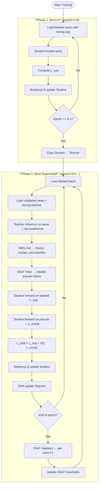

# Hướng Dẫn Implement Efficient Teacher trong Ultralytics

## Tổng Quan

Document này giải thích chi tiết cách implement framework **Efficient Teacher** cho Semi-Supervised Object Detection trong Ultralytics YOLO, đồng thời phân tích code hiện tại của project.

---

## 1. Kiến Trúc Tổng Quan

```
┌────────────────────────────────────────────────────────────────────────────┐
│                        EFFICIENT TEACHER FRAMEWORK                          │
├────────────────────────────────────────────────────────────────────────────┤
│                                                                             │
│   ┌─────────────────────────────────────────────────────────────────────┐  │
│   │                         DATA LAYER                                   │  │
│   │  ┌─────────────┐  ┌─────────────────┐  ┌─────────────────────────┐  │  │
│   │  │ Labeled     │  │ Unlabeled Weak  │  │ Unlabeled Strong        │  │  │
│   │  │ DataLoader  │  │ DataLoader      │  │ DataLoader              │  │  │
│   │  │ (strong aug)│  │ (minimal aug)   │  │ (strong aug)            │  │  │
│   │  └──────┬──────┘  └───────┬─────────┘  └───────────┬─────────────┘  │  │
│   │         │                 │ ←─── Synchronized ───→ │                │  │
│   └─────────┼─────────────────┼────────────────────────┼────────────────┘  │
│             │                 │                        │                    │
│   ┌─────────┼─────────────────┼────────────────────────┼────────────────┐  │
│   │         │     MODEL LAYER │                        │                │  │
│   │         │                 ▼                        ▼                │  │
│   │         │        ┌────────────────┐      ┌─────────────────┐       │  │
│   │         │        │ TEACHER MODEL  │      │  STUDENT MODEL  │       │  │
│   │         │        │ (EMA weights)  │      │  (trainable)    │       │  │
│   │         │        └───────┬────────┘      └────────┬────────┘       │  │
│   │         │                │                        │                 │  │
│   │         │                ▼                        │                 │  │
│   │         │      ┌──────────────────┐               │                 │  │
│   │         │      │ PSEUDO LABEL     │               │                 │  │
│   │         │      │ ASSIGNER (PLA)   │◄──────────────┘                 │  │
│   │         │      │ • NMS-Unc        │                                 │  │
│   │         │      │ • DSAT Filter    │                                 │  │
│   │         │      │ • Soft/Hard Loss │                                 │  │
│   │         │      └────────┬─────────┘                                 │  │
│   └─────────┼───────────────┼───────────────────────────────────────────┘  │
│             │               │                                               │
│   ┌─────────┼───────────────┼───────────────────────────────────────────┐  │
│   │         │   LOSS LAYER  │                                           │  │
│   │         ▼               ▼                                           │  │
│   │  ┌─────────────┐  ┌─────────────┐  ┌─────────────┐                 │  │
│   │  │  L_sup      │  │ L_reliable  │  │ L_uncertain │                 │  │
│   │  │ (labeled)   │  │ (hard target│  │ (soft target│                 │  │
│   │  └──────┬──────┘  └──────┬──────┘  └──────┬──────┘                 │  │
│   │         │                │                │                         │  │
│   │         └────────────────┼────────────────┘                         │  │
│   │                          ▼                                          │  │
│   │                  ┌───────────────┐                                  │  │
│   │                  │ EPOCH ADAPTOR │                                  │  │
│   │                  │ • Burn-in     │                                  │  │
│   │                  │ • λ warmup    │                                  │  │
│   │                  │ • τ schedule  │                                  │  │
│   │                  └───────────────┘                                  │  │
│   └─────────────────────────────────────────────────────────────────────┘  │
│                                                                             │
└────────────────────────────────────────────────────────────────────────────┘
```

---

## 2. Component-by-Component Implementation

### 2.1 Teacher-Student Framework (EMA)

**Paper formulation:**
$$\theta_{teacher}^{(t+1)} = \beta \cdot \theta_{teacher}^{(t)} + (1 - \beta) \cdot \theta_{student}^{(t)}$$

**Ultralytics implementation:**

```python
from ultralytics.utils.torch_utils import ModelEMA

class SemiTrainer(DetectionTrainer):
    def __init__(self, cfg, ...):
        ...
        self.ema_decay = cfg.get('ema_decay', 0.9996)
        self.teacher = None
    
    def _setup_train(self):
        super()._setup_train()
        # Initialize teacher as EMA of student
        self.teacher = ModelEMA(self.model, decay=self.ema_decay)
```

> [!NOTE]
> **Trong code hiện tại** ([semi_trainer.py](file:///d:/ThucTap/Al_platform_Solar/semi_model/semi_processing/trainer/semi_trainer.py) L82): Bạn đã implement đúng với `ModelEMA`. Decay value 0.999 là hợp lý.

**EMA Update Timing:**

```python
# Update teacher AFTER student gradient step, ONLY in semi-supervised phase
if not self.in_burn_in:
    self.teacher.update(self.model)
```

> [!WARNING]
> **Critical:** Teacher phải được update SAU khi student updated, không phải trước.

---

### 2.2 Data Module với Synchronized Sampling

**Efficient Teacher requirement:**
- Teacher inference trên **weak augmented** image
- Student training trên **strong augmented** của **cùng image đó**

**Implementation pattern:**

```python
class SemiDataModule:
    def __init__(self, ...):
        self.sync_seed = 42  # Same seed for synchronized sampling
        self._weak_sampler = SyncRandomSampler(dataset_weak, seed=self.sync_seed)
        self._strong_sampler = SyncRandomSampler(dataset_strong, seed=self.sync_seed)
    
    def set_epoch(self, epoch: int):
        """Reset both samplers with same epoch → same order"""
        self._weak_sampler.set_epoch(epoch)
        self._strong_sampler.set_epoch(epoch)
    
    def get_unsup_batch(self):
        """Returns (weak_batch, strong_batch) of SAME images"""
        weak = next(self._weak_iter)
        strong = next(self._strong_iter)
        return weak, strong
```

> [!TIP]
> **Trong code hiện tại** ([semi_dataset.py](file:///d:/ThucTap/Al_platform_Solar/semi_model/semi_processing/data/semi_dataset.py)): Implementation đã chính xác với [SyncRandomSampler](file:///d:/ThucTap/Al_platform_Solar/semi_model/semi_processing/data/semi_dataset.py#23-47). Đây là điểm quan trọng mà nhiều implementations bỏ qua.

---

### 2.3 Asymmetric Augmentation

**Weak Augmentation (Teacher):**

```python
WEAK_AUG = {
    'hsv_h': 0.0, 'hsv_s': 0.0, 'hsv_v': 0.0,
    'mosaic': 0.0, 'mixup': 0.0,
    'fliplr': 0.5, 'scale': 0.2,  # Minimal geometric
}
```

**Strong Augmentation (Student):**

```python
STRONG_AUG = {
    'hsv_h': 0.015, 'hsv_s': 0.7, 'hsv_v': 0.4,
    'mosaic': 1.0, 'mixup': 0.5,
    'copy_paste': 0.3, 'erasing': 0.3,
}
```

> [!IMPORTANT]
> **Rationale:** Teacher cần predictions ổn định → minimal aug. Student phải học invariance với strong aug.

---

### 2.4 Burn-In Phase & Epoch Adaptor

**Training timeline:**

```
Epoch:    0     1     2     3     4     5     6     7     ...
          |←── Burn-in ──→|←── Semi-supervised phase ──→|
λ_unsup:  0     0     0     0     0    0.2   0.4   0.6   ... → 1.0
```

**Implementation:**

```python
def _get_lambda_unsup(self, epoch: int) -> float:
    """Unsupervised loss weight scheduling"""
    if epoch < self.burn_in_epochs:
        return 0.0  # Burn-in: supervised only
    
    effective_epoch = epoch - self.burn_in_epochs
    if effective_epoch < self.lambda_warmup:
        return self.lambda_unsup * (effective_epoch / self.lambda_warmup)
    
    return self.lambda_unsup  # Full weight
```

**Teacher sync at burn-in end:**

```python
# At transition from burn-in → semi
if was_burn_in and not self.in_burn_in:
    # Copy fully trained student weights to teacher
    self.teacher.ema.load_state_dict(self.model.state_dict())
```

> [!NOTE]
> **Trong code hiện tại** ([semi_trainer.py](file:///d:/ThucTap/Al_platform_Solar/semi_model/semi_processing/trainer/semi_trainer.py) L155-158): Đã implement đúng teacher sync.

---

### 2.5 Pseudo Label Assigner (Core Component)

**Efficient Teacher's PLA phân loại pseudo-labels thành 3 categories:**

| Category | Condition | Treatment |
|----------|-----------|-----------|
| **Reliable** | $s > \tau_1$ | Hard labels, full loss |
| **Uncertain** | $\tau_2 < s \leq \tau_1$ | Soft labels, weighted loss |
| **Discarded** | $s \leq \tau_2$ | Treat as background |

**Current implementation (partial):**

```python
# dsat.py - Only implements reliable/discarded split
def __call__(self, predictions: Dict[str, Tensor], ...):
    conf_mask = cls_max >= per_sample_threshold  # τ
    if uncertainties is not None:
        unc_mask = uncertainties <= self.uncertainty_threshold
        mask = conf_mask & unc_mask
    return mask, cls_max
```

> [!CAUTION]
> **Missing:** Two-tier soft/hard loss. Hiện tại code chỉ có binary accept/reject.

**Recommended enhancement:**

```python
class EfficientTeacherPLA:
    """Full Pseudo Label Assigner with soft targets"""
    
    def __init__(self, tau1=0.7, tau2=0.3, mu=0.5):
        self.tau1 = tau1  # Reliable threshold
        self.tau2 = tau2  # Uncertain threshold
        self.mu = mu      # Uncertain loss weight
    
    def __call__(self, predictions, scores):
        reliable_mask = scores > self.tau1
        uncertain_mask = (scores > self.tau2) & (scores <= self.tau1)
        background_mask = scores <= self.tau2
        
        return {
            'reliable': reliable_mask,
            'uncertain': uncertain_mask,
            'background': background_mask,
            'soft_weights': scores[uncertain_mask],  # For soft loss
        }
```

---

### 2.6 Loss Computation

**Paper formulation:**

$$\mathcal{L}_{total} = \mathcal{L}_{sup} + \lambda(t) \cdot (\mathcal{L}_{reliable} + \mu \cdot \mathcal{L}_{uncertain})$$

**Current implementation ([semi_trainer.py](file:///d:/ThucTap/Al_platform_Solar/semi_model/semi_processing/trainer/semi_trainer.py) L192-223):**

```python
with torch.autocast(...):
    batch = self.preprocess_batch(batch)
    loss_sup, loss_items_sup = self.model(batch)

    if self.in_burn_in or self.semi_data is None:
        loss = loss_sup
        loss_unsup = torch.tensor([0.0, 0.0, 0.0], device=self.device)
    else:
        loss_unsup, loss_items_unsup = self._compute_unsup_loss()
        
        # Safety clipping (good practice!)
        if unsup_loss_val > sup_loss_val * max_unsup_ratio:
            scale_factor = (sup_loss_val * max_unsup_ratio) / (unsup_loss_val + 1e-8)
            loss_unsup = loss_unsup * scale_factor
        
        loss = loss_sup + lambda_u * loss_unsup
```

> [!TIP]
> **Loss clipping** (`max_unsup_ratio = 2.0`) là một safety mechanism tốt để prevent training collapse.

---

### 2.7 DSAT - Dynamic Self-Adaptive Threshold

**Core idea:** Threshold tối ưu là điểm maximize F1-score.

$$\tau^*_c = \arg\max_{\tau} F_1(\tau; c)$$

**Current implementation ([dsat.py](file:///d:/ThucTap/Al_platform_Solar/semi_model/semi_processing/filters/dsat.py) + [dsat_validator.py](file:///d:/ThucTap/Al_platform_Solar/semi_model/semi_processing/validators/dsat_validator.py)):**

```python
# dsat_validator.py - Compute per-class F1
def _compute_f1(self) -> Tensor:
    f1_scores = torch.zeros(self.nc)
    for c in range(self.nc):
        tp, fp, fn = self.tp[c], self.fp[c], self.fn[c]
        precision = tp / (tp + fp + 1e-8)
        recall = tp / (tp + fn + 1e-8)
        f1 = 2 * precision * recall / (precision + recall + 1e-8)
        f1_scores[c] = f1
    return f1_scores

# dsat.py - Update thresholds from F1
def update_from_f1(self, per_class_f1: Tensor):
    """Higher F1 → higher threshold, Lower F1 → lower threshold"""
    target_thresholds = self.min_threshold + per_class_f1 * (self.max_threshold - self.min_threshold)
    self.class_thresholds = (
        self.momentum * self.class_thresholds +
        (1 - self.momentum) * target_thresholds
    )
```

> [!WARNING]
> **Mathematical note:** Current mapping `F1 → threshold` is linear. Original DSAT uses F1-maximizing threshold from PR curve analysis, which is different.

**Recommended improvement:**

```python
def find_optimal_threshold_from_pr(self, confidences, is_correct, class_id):
    """
    Find threshold that maximizes F1 from PR curve.
    This is the true DSAT approach.
    """
    thresholds = torch.linspace(0.1, 0.9, 9)
    best_f1 = 0
    best_threshold = 0.5
    
    for tau in thresholds:
        mask = confidences >= tau
        if mask.sum() == 0:
            continue
        
        tp = (mask & is_correct).sum()
        fp = (mask & ~is_correct).sum()
        fn = (~mask & is_correct).sum()
        
        p = tp / (tp + fp + 1e-8)
        r = tp / (tp + fn + 1e-8)
        f1 = 2 * p * r / (p + r + 1e-8)
        
        if f1 > best_f1:
            best_f1 = f1
            best_threshold = tau
    
    return best_threshold
```

---

## 3. So Sánh: Code Hiện Tại vs Paper

| Component | Paper | Your Implementation | Gap |
|-----------|-------|---------------------|-----|
| **EMA Teacher** | ✓ | ✓ `ModelEMA` | None |
| **Burn-in Phase** | ✓ | ✓ 5 epochs | None |
| **Weak/Strong Aug** | ✓ | ✓ Separated | None |
| **Synchronized Sampling** | ✓ | ✓ [SyncRandomSampler](file:///d:/ThucTap/Al_platform_Solar/semi_model/semi_processing/data/semi_dataset.py#23-47) | None |
| **Lambda Warmup** | ✓ | ✓ Linear ramp | None |
| **Teacher Sync at Burn-in End** | ✓ | ✓ `load_state_dict` | None |
| **DSAT Threshold** | Per-class adaptive | ✓ Per-class | Mapping method differs |
| **Two-Tier Pseudo Labels** | Reliable + Uncertain | Binary only | **Missing soft loss** |
| **CIoU-based Objectness** | ✓ | ✗ | **Missing** |
| **Domain Adaptation** | GRL + Adversarial | ✗ | **Missing** (optional) |

---

## 4. Recommended Enhancements

### 4.1 Add Two-Tier Loss (Priority: HIGH)

```python
def _compute_unsup_loss(self):
    """Enhanced with soft/hard targets"""
    ...
    for img_idx, (boxes, scores, labels, uncertainties) in enumerate(pseudo_results):
        # Categorize predictions
        reliable_mask = scores > self.tau1
        uncertain_mask = (scores > self.tau2) & (scores <= self.tau1)
        
        # Reliable: use as hard labels
        if reliable_mask.sum() > 0:
            reliable_boxes.append(boxes[reliable_mask])
            reliable_labels.append(labels[reliable_mask])
        
        # Uncertain: use with soft weights
        if uncertain_mask.sum() > 0:
            uncertain_boxes.append(boxes[uncertain_mask])
            uncertain_labels.append(labels[uncertain_mask])
            uncertain_weights.append(scores[uncertain_mask])  # Soft weights
    
    # Compute losses
    L_reliable = self.model(reliable_batch)  # Standard loss
    L_uncertain = self._soft_loss(uncertain_batch, uncertain_weights)  # Weighted
    
    return L_reliable + self.mu * L_uncertain
```

### 4.2 CIoU-based Quality Score (Priority: MEDIUM)

```python
def compute_pseudo_quality_score(self, boxes_pred, boxes_nms, cls_scores):
    """
    Combine classification confidence with localization quality.
    s = cls_score * CIoU(pred, NMS_selected)
    """
    # CIoU between raw predictions and NMS-refined
    ciou_quality = box_ciou(boxes_pred, boxes_nms)
    combined_score = cls_scores * ciou_quality
    return combined_score
```

### 4.3 Dynamic Threshold Scheduling (Priority: LOW)

```python
def update_thresholds(self, epoch, total_epochs):
    """Reduce thresholds over training for more pseudo-labels"""
    progress = (epoch - self.burn_in_epochs) / (total_epochs - self.burn_in_epochs)
    
    # τ1: 0.9 → 0.7 over training
    self.tau1 = 0.9 - 0.2 * progress
    # τ2: 0.5 → 0.3 over training
    self.tau2 = 0.5 - 0.2 * progress
```

---

## 5. Training Pipeline Summary



---

## 6. Hyperparameters Reference

| Parameter | Paper Value | Current Value | Notes |
|-----------|-------------|---------------|-------|
| `ema_decay` | 0.9996 | 0.999 | Slightly aggressive, OK |
| `burn_in_epochs` | ~1/10 total | 5 | Depends on total epochs |
| [lambda_unsup](file:///d:/ThucTap/Al_platform_Solar/semi_model/semi_processing/trainer/semi_trainer.py#486-496) | 1.0 | 1.0 | ✓ |
| `lambda_warmup` | 5 epochs | 5 epochs | ✓ |
| `tau1` (reliable) | 0.7 | 0.5 (initial) | Consider raising |
| `tau2` (uncertain) | 0.3 | N/A | Not implemented |
| [mu](file:///d:/ThucTap/Al_platform_Solar/semi_model/semi_processing/trainer/semi_trainer.py#504-511) (uncertain weight) | 0.5 | N/A | Not implemented |
| `conf_thres` (NMS) | 0.25-0.5 | 0.01 | Very low, consider raising |

---

## 7. Kết Luận

Project hiện tại đã implement **~70%** của Efficient Teacher framework:

**✅ Đã có:**
- EMA Teacher-Student
- Burn-in phase với teacher sync
- Synchronized weak/strong dataloaders
- DSAT per-class adaptive thresholds
- Lambda unsup warmup
- Loss clipping safety

**❌ Chưa có:**
- Two-tier soft/hard pseudo-label loss
- CIoU-based quality scoring
- Domain adaptation (optional)
- True F1-maximizing threshold search

Các enhancement được recommend theo thứ tự ưu tiên: **Two-tier loss > CIoU scoring > Dynamic threshold scheduling**.
